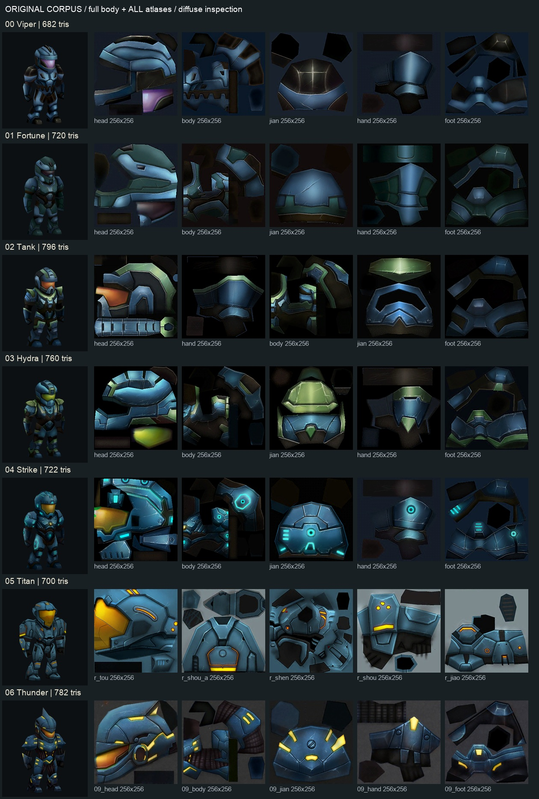
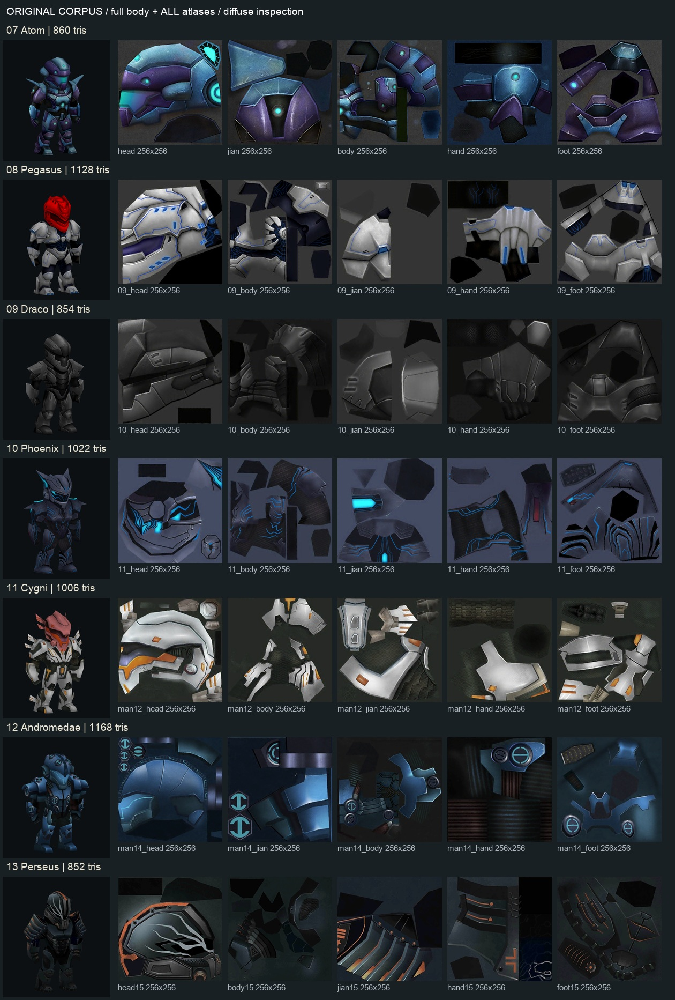
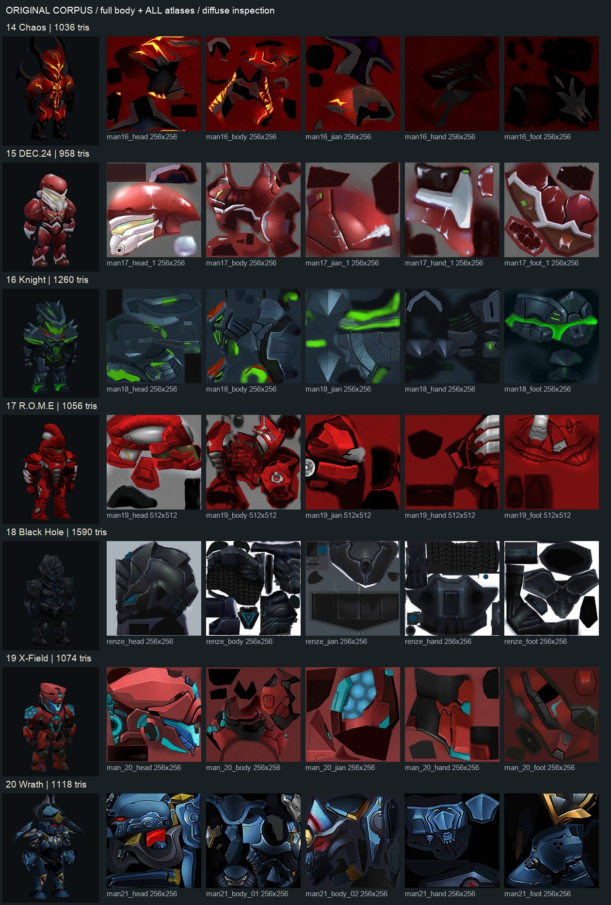
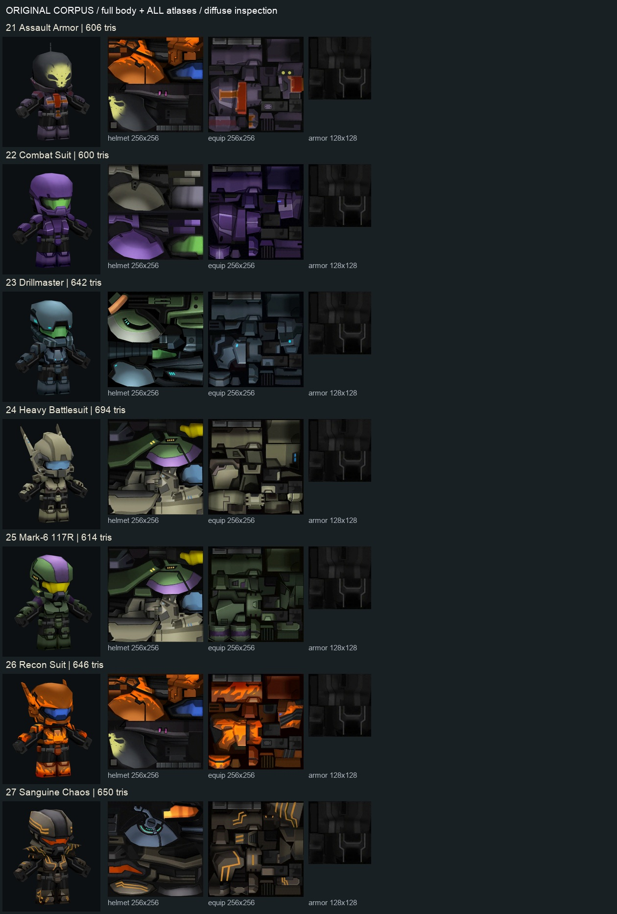
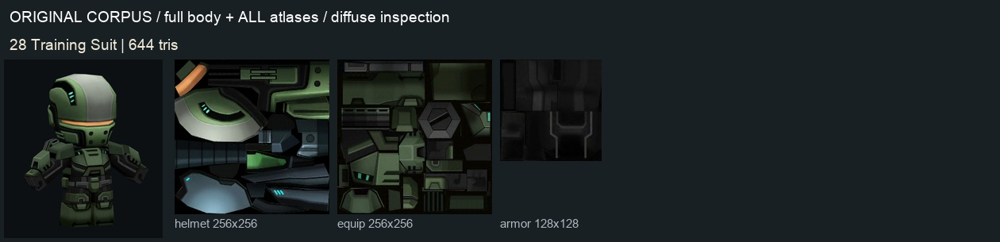

# 全部原版裝甲：基底 prompt 的證據

**生成時使用 [Claude＋Codex 整合規格](../ARMOR_TEXTURE_STYLE_SPEC.md)；本目錄保存全部舊裝甲的依據，方便下一個工作直接取用。** 原版決定遊戲比例與畫法，新概念決定新造型，實際模型的 UV 決定貼圖位置。

| 內容 | 檔案 |
| --- | --- |
| 完整分析、修正後規則、可複製 prompt 與 sol6.1 工作指令 | [ARMOR_TEXTURE_STYLE_SPEC.md](../ARMOR_TEXTURE_STYLE_SPEC.md) |
| 共用生成 prompt，內容與上方文件一致 | [base_prompt.txt](base_prompt.txt) |
| Cygni 示範附加條件 | [cygni_addon.txt](cygni_addon.txt) |
| 全部來源、雜湊、尺寸、透明度、面數、頭部幾何、概念映射與擷取設定 | [inventory.json](inventory.json) |
| Claude 原稿統計的複算結果，包含 atlas 底色，不作風格通關門檻 | [claude_statistics_check.json](claude_statistics_check.json) |

## 全套模型

**兩組原素材各自有一致的畫法，但身體比例不能直接混成一組平均值。** SW 用原 `player.gltf`；CoM 用與原 ZIP 相同的 DAE 與原 PNG，沒有使用精修貼圖或修改後的 Assault 模型。

### Star Warfare：全部 21 套

**下面保留原匯入 tint 以揭露差異；Pegasus 的紅頭、Cygni 的粉頭不代表使用者要求的新配色。** 其原 atlas 都有白灰甲片，生成新版時頭盔應依使用者指定與身甲同色。


### Call of Mini：全部 8 套

**這組是原 DAE 的 bind/rest 外觀，不是適配到遊戲骨架後的身材。** 用中性 unlit 顯示讀取畫法，原模型朝 +Z，因此僅旋轉展示根節點，與 SW 的正面方向對齊；未翻動 UV。不能把此展示當成原遊戲的光照重現。


## 原模型與全部貼圖

**下列五頁涵蓋 29 套的全部 129 個 PNG 路徑；貼圖是原檔排版，沒有生成或重繪。** SW 的尺寸標籤按匯出器 2 倍放大規則還原，CoM 標示 ZIP 原尺寸。Tank 的手部圖在兩個 material slot 使用，但這裡只列一次。







## 多視角參考與使用方式

**單套生成時附目標原圖及相近套即可；全部分析用來找共通規則，不是要求生成器把所有造型融合。** 例如 Cygni 用原 Cygni 的多視圖／白甲 atlas 加上新概念，而不是只餵上一版失敗的 HD atlas。

- [Viper 正／斜／側／背](references/original_00_views.png)
- [Hydra 正／斜／側／背](references/original_03_views.png)
- [Atom 正／斜／側／背](references/original_07_views.png)
- [Cygni 正／斜／側／背](references/original_11_views.png)
- [Mark-6 117R 正／斜／側／背](references/original_25_views.png)

全部 116 張原尺寸擷取在可重建的 `test_output/armor_original_corpus/`，檔名與相機設定保存在 inventory。上面兩張 family 圖、五頁 corpus 與五張多視圖是文件中可攜帶的參考。

## 重建與驗證

**兩支工具只讀原始資產、擷取視圖及輸出分析，不更動遊戲素材。** Godot 的強制繪製避免 macOS 視窗被遮住時漏掉擷取，Pillow 僅作資料檢查及參考圖排版。

```sh
/opt/homebrew/bin/godot --path . --rendering-method gl_compatibility --disable-render-loop --script res://tools/armor_concept_runtime/capture_original_corpus.gd
python3 tools/armor_concept_runtime/analyze_original_corpus.py
```

| 檢查 | 2026-10-02 結果 |
| --- | --- |
| 原版 SW 資產分析 | PASS：21 套、84 mesh、105 不同 PNG、106 surface 使用位置 |
| CoM ZIP 一致性 | PASS：8 DAE、24 PNG 與原 ZIP 位元組相同 |
| Godot 擷取 | PASS：116 張，640×720，Godot 4.7.2，Compatibility，Apple M4 |
| 分析工具 | PASS：29 套、130 貼圖使用位置、129 PNG 路徑 |
| 材質畫法觀察 | 已檢視全部 family／atlas 頁；屬目視歸納，不是相似度量測 |
| 新資產生成／入遊戲 | NOT RUN：依最新要求交給後續 sol6.1 工作 |

原 PNG 可在 inventory 的 `entries[].textures[].path` 找到，生成器應讀原檔，避免把整頁帶標題的參考拼圖誤當成目標 atlas。影像統計只描述像素分布，不能測 UV、比例、骨架或美術一致性。
